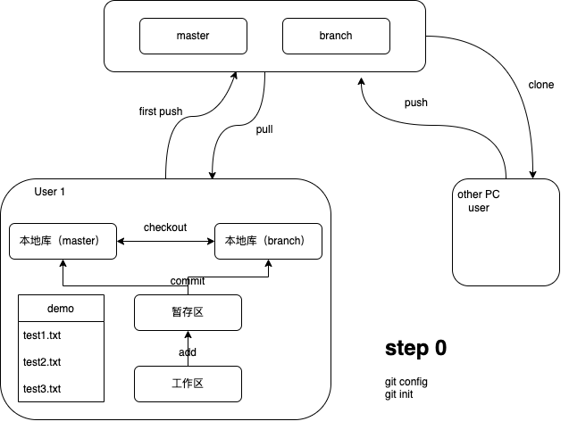

# git命令16条

​    通过1天的git学习对git有个大致的了解。git的所有命令都知道是不可能了。本人也不想做git专家，也不想背诵太多的命令，本着够用就行以及配合图形软件的应用，我总结了16条基本的git命令。有了这16条命令的底子，再加上百度，谷歌，我相信还是能够操作git的。

​    git设计是相当复杂的，有组内开发的（用一个服务器），有大规模开发的（多个服务器，设计fork，pull request，merge）。在这里我先总结一下组内开发部分。废话不多说，先上图。



先上15个命令

| 配置以及初始化命令 | config     | init     |        |      |
| ------------------ | ---------- | -------- | ------ | ---- |
| 本地基本操作命令   | status     | add      | commit |      |
| 本地版本管理命令   | log/reflog | diff     | merge  |      |
| 本地分支切换命令   | brach      | checkout |        |      |
| 远程服务器上传命令 | remote     | push     |        |      |
| 远端服务器下载命令 | clone      | fetch    | pull   |      |


## 配置以及初始化命令

要用git肯定是要做事前准备的。比如安装git软件，准备服务器。这部分都完成后首先要对git进行整体的一个配置。

### 1. config

作用：配置git的基本信息，我这里配置了四个，分别是用户名，邮箱地址，主分支的默认名称和git的字符显示编码(乱码问题)和配置结果的检查

```bash
$ git config --global user.name "Your Name"
$ git config --global user.email "email@example.com"
$ git config --global init.defaultBranch master
$ git config --global core.quotepath false
$ git config --list
```

> 用户名和邮箱不作为登陆检查用，也就是说你瞎写一个也没问题，但是在commit的log里会有，所以还是建议用有效的内容。
>
> --global 这个意味着在所有项目里应用，具体也没有详细的研究，因为在每个git项目里都用不同的名字的人，貌似还是比较少的。

### 2. init

这个是在没有仓库的前提下需要做的事情，如果人家已经建好了仓库，你可以直接clone。这个命令是从0开始的项目需要这个操作。

作用：初始化一个文件夹为git管理的文件夹。（单位是文件夹，是否是空文件夹不要求）

```bash
$ cd demo
$ git init
```

> 这些命令是根据项目的具体情况需要设定的东西

---

## 本地基本操作命令

### 3. status

作用：查看当前工作区文件的状态。

```bash
$ git status
```

- 未跟踪的文件
- 要提交的变更


### 4. add

作用：把工作区的文件，添加到缓存区。

```bash
$ git add <file name>
or
$ git add .
```

### 5.commit

作用：把缓存区的文件，添加到本地库

```bash
$ git commit -m <"commit log"> <file name>
or
$ git commit -m <"commit log"> .
```

---

## 本地版本管理命令

### 6. log/reflog

这是一个查看commit历史的命令。表示方法有很多，我看网上视频大家用的最多的是reflog，log比较紧凑。

```bash
$ curtis@littleGray demo % git reflog
ab63ff0 (HEAD -> master) HEAD@{0}: commit: add new line at test1.txt
523ecee HEAD@{1}: commit: fix test1.txt
722e70d HEAD@{2}: commit (initial): create file
$ curtis@littleGray demo % 
```

